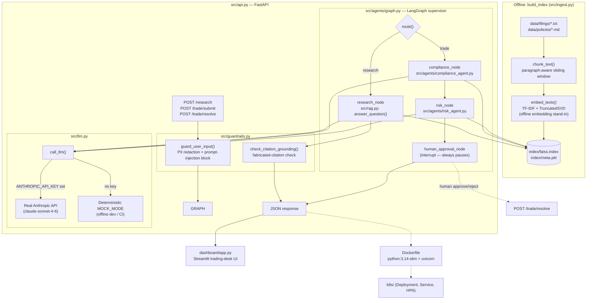

# MarketMind

An agentic research and trade-compliance assistant for a broker-dealer front office. Given a natural-language research question, it retrieves grounded answers (with citations) from SEC filings and internal policy documents. Given a proposed trade, it runs a compliance check and a blended quant/LLM risk score, then pauses for mandatory human approval before anything is considered "executed."

> Demo build — synthetic filings and policies only (`data/`). Not investment advice.

## Architecture



**Key design points**

- **Grounded, not generative-only**: every research answer must cite a source filename; [`check_citation_grounding`](src/guardrails.py) flags any citation that wasn't actually retrieved.
- **Offline-first embeddings**: [`embed_texts()`](src/ingest.py) uses TF-IDF + `TruncatedSVD` instead of a hosted embedding model, so ingestion and retrieval work with zero network access and zero API cost. Swapping in real embeddings later only touches this one function.
- **Mock-mode LLM**: [`src/llm.py`](src/llm.py) automatically falls back to deterministic canned responses when `ANTHROPIC_API_KEY` isn't set, so the whole pipeline (retrieval → agents → orchestration → guardrails → eval) is runnable and testable without a paid key.
- **No autonomous trade execution**: the LangGraph orchestration in [`src/agents/graph.py`](src/agents/graph.py) always routes trades through compliance → risk → a hard `interrupt_before=["human_approval_node"]` — a human must call `POST /trade/resolve` before a trade is considered approved or rejected.

## Project structure

```
market-mind/
├── data/
│   ├── filings/            # synthetic 10-K excerpts (ACME, BEACON, HARBOR)
│   ├── policies/           # trading compliance policy (markdown)
│   └── documents/          # sample PDFs/scanned image for OCR/doc-intelligence
├── src/
│   ├── ingest.py            # chunk, embed, build FAISS index (+ real EDGAR fetcher)
│   ├── rag.py                # RetrievalIndex, answer_question()
│   ├── llm.py                 # call_llm() — real Anthropic API or MOCK_MODE
│   ├── guardrails.py           # PII redaction, prompt-injection guard, citation check
│   ├── eval.py                  # offline RAGAS-inspired grounding/recall eval harness
│   ├── api.py                    # FastAPI: /research, /trade/submit, /trade/resolve
│   └── agents/
│       ├── graph.py                # LangGraph supervisor wiring all nodes together
│       ├── compliance_agent.py      # policy-grounded compliance verdict (CoT)
│       └── risk_agent.py             # quant concentration % blended with LLM judgement
├── dashboard/
│   └── app.py               # Streamlit trading-desk UI (talks to the FastAPI layer)
├── tests/
│   ├── test_guardrails.py    # guardrail unit tests
│   └── eval_questions.json    # question set for src/eval.py
├── k8s/                        # Deployment, Service, HorizontalPodAutoscaler
├── Dockerfile
├── requirements.txt
└── .github/workflows/ci.yml    # GitHub Actions pipeline
```

## Setup

Requires Python. CI runs on **3.11**; `requirements.txt` is pinned to versions that resolve on 3.11 (Linux/CI) as well as newer interpreters — if you're on a very new Python (e.g. 3.14 on Windows), some pins were bumped past their original course versions purely for wheel availability.

```bash
python -m venv .venv
# Windows (Git Bash):
source .venv/Scripts/activate
# Windows (PowerShell):
# .venv\Scripts\Activate.ps1
# macOS/Linux:
# source .venv/bin/activate

pip install -r requirements.txt
```

### Configure your Anthropic key (optional but recommended)

Without a key, everything runs in deterministic `MOCK_MODE` — useful for offline dev and CI, but answers are canned placeholders, not real model output.

1. Copy the template: `cp .env.example .env` (`.env` is already git-ignored — never commit real keys).
2. Get a key from [console.anthropic.com](https://console.anthropic.com) → **Settings → API Keys**.
3. Edit `.env` and set:
   ```
   ANTHROPIC_API_KEY=sk-ant-...
   ```
   `src/llm.py` calls `load_dotenv()` on import, so any script that imports it picks up the key automatically — no manual `export` needed.

## Running it

**1. Build the vector index** (required before anything else — reads `data/`, writes `index/faiss.index` + `index/meta.pkl`):
```bash
python src/ingest.py
```

**2. Try retrieval + agents directly** (no server needed):
```bash
python -m src.rag                        # grounded research Q&A demo
python -m src.agents.compliance_agent    # sample trade compliance review
python -m src.agents.risk_agent          # sample trade risk score
python -m src.agents.graph               # full research + trade + approval flow
```

**3. Run the API:**
```bash
uvicorn src.api:app --reload --port 8000
```
```bash
curl -X POST http://localhost:8000/research \
  -H "Content-Type: application/json" \
  -d '{"query": "What are ACME Robotics main risk factors?"}'
```

**4. Run the dashboard** (with the API already running in another terminal):
```bash
streamlit run dashboard/app.py
```

## Testing & evaluation

```bash
python tests/test_guardrails.py   # guardrail unit tests (PII, injection, citation checks)
python src/eval.py                # offline grounding/recall eval — exits 1 if below threshold
```

`src/eval.py` is a dependency-free, RAGAS-inspired harness (`context_precision@k`, `keyword_recall`, citation presence) that runs fully offline so it can gate every PR in CI without needing LLM API access.

## Docker

```bash
docker build -t marketmind .
docker run -p 8000:8000 --env-file .env marketmind
```

The image builds the vector index at build time (`RUN python3 src/ingest.py`), so the container serves immediately on start. `.dockerignore` excludes `.env`, `.venv/`, and `.git/` from the build context so secrets and local-only artifacts never end up baked into an image layer.

## Kubernetes

`k8s/` contains a `Deployment` (3 replicas, readiness/liveness probes on `/health`), a `ClusterIP` `Service`, and an `HorizontalPodAutoscaler` (2–8 replicas, target 70% CPU). The Anthropic key is expected as a Secret:

```bash
kubectl create secret generic marketmind-secrets \
  --from-literal=anthropic-api-key=sk-ant-...
kubectl apply -f k8s/
```

## CI

`.github/workflows/ci.yml` runs on every push/PR to `main` (Python 3.11, `ubuntu-latest`): installs dependencies, builds the index, runs the guardrail tests and the eval harness, then smoke-tests the API starting up and validates the `k8s/*.yaml` manifests parse. A few steps referenced in the workflow (document-intelligence tests, rebalancing-agent tests, an `src/llmops` MLflow module) are placeholders for functionality not yet implemented in `src/` — check `ci.yml` against current `src/`/`tests/` contents before assuming a green pipeline covers everything it references.

## Environment variables

| Variable | Required | Purpose |
|---|---|---|
| `ANTHROPIC_API_KEY` | No | Enables real Claude responses via `src/llm.py`. Omit to run in offline `MOCK_MODE`. |
