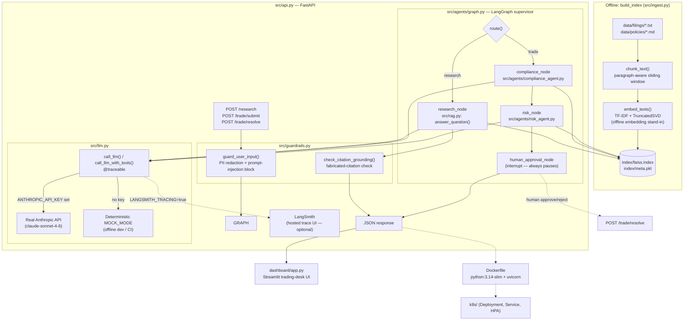
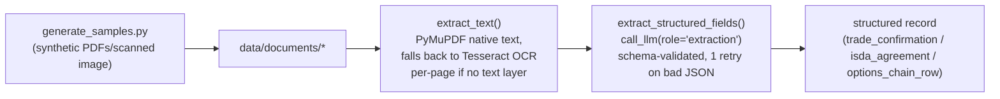
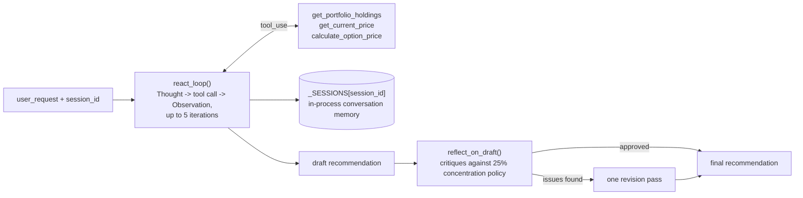
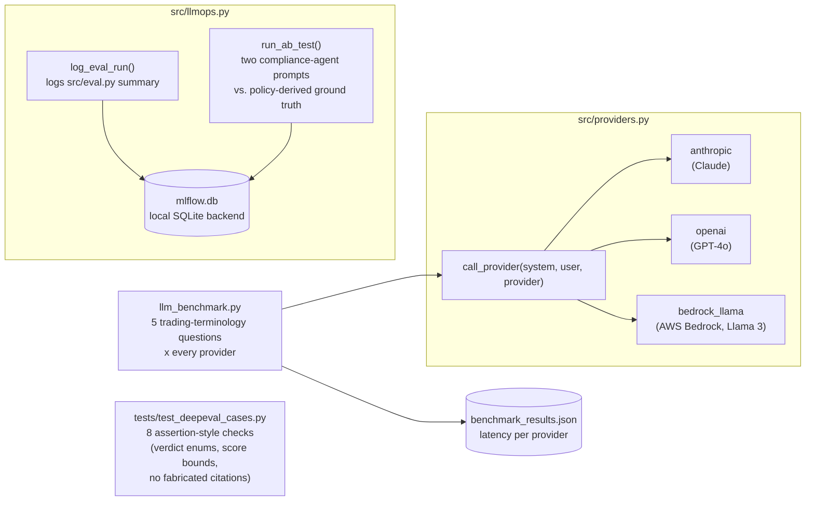

# MarketMind

An agentic research and trade-compliance assistant for a broker-dealer front office. Given a natural-language research question, it retrieves grounded answers (with citations) from SEC filings and internal policy documents. Given a proposed trade, it runs a compliance check and a blended quant/LLM risk score, then pauses for mandatory human approval before anything is considered "executed."

> Demo build — synthetic filings and policies only (`data/`). Not investment advice.

## Architecture



**Key design points**

- **Grounded, not generative-only**: every research answer must cite a source filename; [`check_citation_grounding`](src/guardrails.py) flags any citation that wasn't actually retrieved.
- **Offline-first embeddings**: [`embed_texts()`](src/ingest.py) uses TF-IDF + `TruncatedSVD` instead of a hosted embedding model, so ingestion and retrieval work with zero network access and zero API cost. Swapping in real embeddings later only touches this one function.
- **Mock-mode LLM**: [`src/llm.py`](src/llm.py) automatically falls back to deterministic canned responses when `ANTHROPIC_API_KEY` isn't set, so the whole pipeline (retrieval → agents → orchestration → guardrails → eval) is runnable and testable without a paid key.
- **No autonomous trade execution**: the LangGraph orchestration in [`src/agents/graph.py`](src/agents/graph.py) always routes trades through compliance → risk → a hard `interrupt_before=["human_approval_node"]` — a human must call `POST /trade/resolve` before a trade is considered approved or rejected.
- **Tracing is opt-in and free by default**: [`call_llm()`/`call_llm_with_tools()`](src/llm.py) are wrapped with LangSmith's `@traceable`, which is a true no-op unless `LANGSMITH_TRACING=true` — no external account is required to run anything in this repo.

### Document intelligence pipeline

Separate from the main RAG flow above — ingests scanned/native PDFs and images into structured records.



### Rebalancing agent (ReAct, Memory, Reflection)



### Multi-provider abstraction & LLMOps



## Project structure

```
market-mind/
├── data/
│   ├── filings/            # synthetic 10-K excerpts (ACME, BEACON, HARBOR)
│   ├── policies/           # trading compliance policy (markdown)
│   └── documents/          # sample PDFs/scanned image, generated by src/document_intelligence/generate_samples.py
├── src/
│   ├── ingest.py                    # chunk, embed, build FAISS index (+ real EDGAR fetcher)
│   ├── rag.py                       # RetrievalIndex, answer_question()
│   ├── llm.py                       # call_llm() — real Anthropic API or MOCK_MODE, LangSmith @traceable
│   ├── guardrails.py                # PII redaction, prompt-injection guard, citation check
│   ├── eval.py                      # offline RAGAS-inspired grounding/recall eval harness
│   ├── llmops.py                    # MLflow eval-run logging + compliance-prompt A/B test
│   ├── providers.py                 # provider-agnostic call_provider() — Anthropic/OpenAI/Bedrock Llama
│   ├── llm_benchmark.py             # side-by-side latency benchmark across providers
│   ├── api.py                       # FastAPI: /research, /trade/submit, /trade/resolve
│   ├── document_intelligence/
│   │   ├── generate_samples.py      # creates synthetic sample PDFs/scanned image
│   │   └── extract.py               # OCR/native extraction + LLM structured-field extraction
│   └── agents/
│       ├── graph.py                 # LangGraph supervisor wiring all nodes together
│       ├── compliance_agent.py      # policy-grounded compliance verdict (CoT)
│       ├── risk_agent.py            # quant concentration % blended with LLM judgement
│       └── rebalancing_agent.py     # ReAct tool-calling + session memory + Reflection
├── dashboard/
│   └── app.py               # Streamlit trading-desk UI (talks to the FastAPI layer)
├── tests/
│   ├── test_guardrails.py      # guardrail unit tests
│   ├── test_deepeval_cases.py  # DeepEval assertion-style tests (mode-agnostic — pass in MOCK_MODE and real mode)
│   └── eval_questions.json     # question set for src/eval.py
├── k8s/                        # Deployment, Service, HorizontalPodAutoscaler
├── Dockerfile
├── requirements.txt
└── .github/workflows/ci.yml    # GitHub Actions pipeline
```

## Setup

Requires Python 3.14 (both CI and local dev are pinned to this version — several `requirements.txt` pins were bumped past their original values purely because Python 3.14 is new enough that older pinned versions had no prebuilt wheel for it yet).

```bash
python -m venv .venv
# Windows (Git Bash):
source .venv/Scripts/activate
# Windows (PowerShell):
# .venv\Scripts\Activate.ps1
# macOS/Linux:
# source .venv/bin/activate

pip install -r requirements.txt
```

### Configure your API keys

Everything works without any keys — `src/llm.py` falls back to deterministic `MOCK_MODE`, and `src/providers.py` mocks each provider independently. Real keys are optional but give real model output.

1. Copy the template: `cp .env.example .env` (`.env` is already git-ignored — never commit real keys, and never paste one into a chat/AI tool).
2. Fill in whichever of these you have, directly in `.env`:

   | Variable | Enables |
   |---|---|
   | `ANTHROPIC_API_KEY` | Real Claude responses via `src/llm.py` and `src/providers.py`. Get one at [console.anthropic.com](https://console.anthropic.com) → Settings → API Keys. |
   | `OPENAI_API_KEY` | GPT-4o path in `src/providers.py` / `src/llm_benchmark.py`. |
   | `AWS_ACCESS_KEY_ID` / `AWS_REGION` | Bedrock Llama 3 path in `src/providers.py` (requires `bedrock:InvokeModel` permission). |
   | `LANGSMITH_TRACING` / `LANGSMITH_API_KEY` / `LANGSMITH_PROJECT` | Real hosted tracing of every `call_llm()` call. **Only set `LANGSMITH_TRACING=true` once `LANGSMITH_API_KEY` is actually filled in** — otherwise every LLM call fails a trace-send with a (non-fatal) 401. |

   `src/llm.py` calls `load_dotenv()` on import, so any script that imports it picks up `.env` automatically — no manual `export` needed. Note `python-dotenv` resolves `.env`'s location relative to the *importing source file*, not your shell's current directory, so it's found regardless of where you run a command from.

## Running it

**1. Build the vector index** (required before anything else — reads `data/`, writes `index/faiss.index` + `index/meta.pkl`):
```bash
python src/ingest.py
```

**2. Try retrieval + agents directly** (no server needed):
```bash
python -m src.rag                        # grounded research Q&A demo
python -m src.agents.compliance_agent    # sample trade compliance review
python -m src.agents.risk_agent          # sample trade risk score
python -m src.agents.graph               # full research + trade + approval flow
python -m src.agents.rebalancing_agent   # ReAct + memory + reflection demo
```

**3. Document intelligence:**
```bash
python -m src.document_intelligence.generate_samples   # creates data/documents/* once
python -m src.document_intelligence.extract            # extract structured fields from all 3 sample docs
```
Requires the Tesseract OCR binary installed and on `PATH` (not just the `pytesseract` Python package) — the scanned options-chain sample has no text layer and needs real OCR. `Dockerfile` installs it via `apt-get`; on Windows, install via `winget install --id UB-Mannheim.TesseractOCR` and add its install directory to `PATH`.

**4. Multi-provider benchmark:**
```bash
python -m src.llm_benchmark
```
Runs 5 trading-terminology questions against every configured provider (Anthropic/OpenAI/Bedrock Llama), printing latency side by side and writing `benchmark_results.json`. Providers without credentials configured return a mock response rather than erroring.

**5. Run the API:**
```bash
uvicorn src.api:app --reload --port 8000
```
```bash
curl -X POST http://localhost:8000/research \
  -H "Content-Type: application/json" \
  -d '{"query": "What are ACME Robotics main risk factors?"}'
```

**6. Run the dashboard** (with the API already running in another terminal):
```bash
streamlit run dashboard/app.py
```

## Testing & evaluation

```bash
python tests/test_guardrails.py       # guardrail unit tests (PII, injection, citation checks)
python src/eval.py                    # offline grounding/recall eval — exits 1 if below threshold
python tests/test_deepeval_cases.py   # DeepEval assertion-style tests (verdict enums, score bounds, no fabricated citations)
python -m src.llmops                  # logs an eval run + a compliance-prompt A/B test to MLflow
```

`src/eval.py` is a dependency-free, RAGAS-inspired harness (`context_precision@k`, `keyword_recall`, citation presence) that runs fully offline so it can gate every PR in CI without needing LLM API access. Real RAGAS (faithfulness/answer_relevancy/context_precision with an actual LLM judge) was evaluated and **deliberately not installed** — every current `ragas` release pulls in an unpinned `langchain`, which now requires `langgraph>=1.2.5`, a breaking major-version jump from this project's pinned `langgraph==0.2.28` that `src/agents/graph.py` depends on. See the comment in `requirements.txt` for the full reasoning.

`tests/test_deepeval_cases.py` checks structural/business invariants (valid verdict enums, risk-score bounds, the Policy 8 human-approval guardrail always firing, no fabricated citations) rather than open-ended answer quality — deliberately, so the same tests pass identically under real Claude responses and CI's `MOCK_MODE`, without needing an LLM judge or API key.

`python -m src.llmops` uses a local SQLite-backed MLflow tracking store (`mlflow.db`, git-ignored, no server needed) — it logs the eval harness results as a run, and A/B tests two compliance-agent system prompts against ground-truth verdicts derived from the actual thresholds in `data/policies/trading_compliance_policy.md`.

## Docker

```bash
docker build -t marketmind .
docker run -p 8000:8000 --env-file .env marketmind
```

The image builds the vector index at build time (`RUN python3 src/ingest.py`), so the container serves immediately on start. `.dockerignore` excludes `.env`, `.venv/`, and `.git/` from the build context so secrets and local-only artifacts never end up baked into an image layer.

## Kubernetes

`k8s/` contains a `Deployment` (3 replicas, readiness/liveness probes on `/health`), a `ClusterIP` `Service`, and an `HorizontalPodAutoscaler` (2–8 replicas, target 70% CPU). The Anthropic key is expected as a Secret:

```bash
kubectl create secret generic marketmind-secrets \
  --from-literal=anthropic-api-key=sk-ant-...
kubectl apply -f k8s/
```

## CI

`.github/workflows/ci.yml` runs on every push/PR to `main` (Python 3.14, `ubuntu-latest`): installs dependencies, installs Tesseract, runs the guardrail unit tests, builds the vector index, runs the offline RAG eval harness, runs the DeepEval assertion suite, runs the MLflow A/B test smoke check, smoke-tests the API starting up, and validates the `k8s/*.yaml` manifests parse. Every step calls a module that actually exists and passes under `MOCK_MODE` (no `ANTHROPIC_API_KEY` is set in CI) — there are currently no CI steps for document intelligence or the rebalancing agent, since no automated test files exist yet for those (`tests/test_document_intelligence.py` / `tests/test_rebalancing_agent.py` are not present).

## Environment variables

| Variable | Required | Purpose |
|---|---|---|
| `ANTHROPIC_API_KEY` | No | Enables real Claude responses via `src/llm.py` and the `anthropic` path in `src/providers.py`. Omit to run in offline `MOCK_MODE`. |
| `OPENAI_API_KEY` | No | Enables the GPT-4o path in `src/providers.py` / `src/llm_benchmark.py`. Omit to get a mock response for that provider only. |
| `AWS_ACCESS_KEY_ID`, `AWS_REGION` | No | Enables the Bedrock Llama 3 path in `src/providers.py` (needs `bedrock:InvokeModel` permission). Omit to get a mock response for that provider only. |
| `LANGSMITH_TRACING` | No | Set to `true` to enable real LangSmith tracing of `call_llm()`/`call_llm_with_tools()`. Leave `false`/unset for zero-effect no-op tracing (default). |
| `LANGSMITH_API_KEY` | No | Required if `LANGSMITH_TRACING=true`. |
| `LANGSMITH_PROJECT` | No | LangSmith project name traces are grouped under (defaults to `marketmind` in `.env.example`). |
